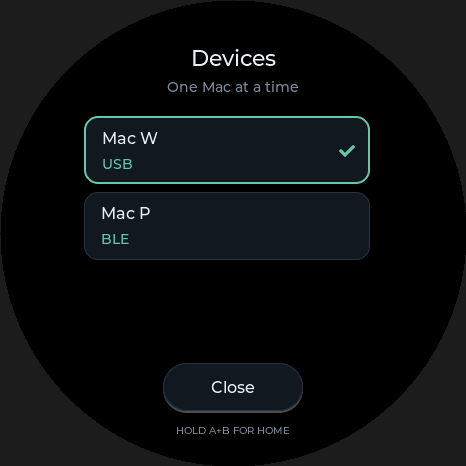

# Codex 主机切换与低功耗：`.10` 候选

`V0.5-friday-codex.10` 基于 `39fed12`，开发目录为 `Fridaybot-host-switching-low-power`。
保留该基线移除 Friday 语音备忘录的结果；本次调整 Codex 主机切换、Agent 状态和身份助手的后台工作。
以下是候选行为及工程验证记录，不代表新固件已刷写或另一台 Mac 已接入。

一次只有选中的 Mac 接收按键和摇杆，顶部名称、传输方式及 Agent 状态随它切换。
例如工作 Mac 经 USB、私人 Mac 经 BLE 同时可用时，可以在设备菜单中手选 `Mac P` 或 `Mac W`。
手选私人 Mac 后，工作 Mac 的 USB 心跳、延迟握手及软件恢复不会周期性抢回控制权。
同一台 Mac 的 USB 与 BLE 都完成身份和原生握手时，优先使用 USB；仅充电或仅枚举不算就绪。
新一次物理 USB 连接应用默认 USB 优先；连接开始后新做的手动选择优先于随后才到达的握手。

拔掉 USB 后，只接续同一台 Mac 已就绪的 BLE；它不可用时显示 `Offline`，其他 Mac 不会自动接管。
也可以手选已记住的离线 Mac，等待它回来。切换时释放旧主机的按住操作，旧会话的排队点击作废。

Agent 状态按颜色、亮度、效果、速度分别保留实际接收时间。同机已就绪的 USB/BLE 原生通道互相接续最新字段：
拔 USB 不会让已显示的状态退回 BLE 旧值，后续真实更新只覆盖相应字段。
身份晚到时按原时间合并，同毫秒连续收到的新更新以最后一条为准；其他 Mac 的字段始终隔离。
同机全部原生控制会话断开或退订后清空 Agent；身份助手不会保留 Agent 缓存，额度过期也会清空。

USB 每轮仍共享 8 毫秒发送预算。预算用完且尚未尝试发送时，点击保留在原有有界队列，
下一轮按“按下、释放”顺序处理；主机或 USB 会话改变后丢弃旧动作。
已经尝试、结果不确定的发送沿用断开恢复，不能作为新点击重试。
这项修复避免预算不足时静默吞点，不承诺故障或断线时每次操作都能送达。

身份助手减少无设备时的扫描和重复后台请求：

| 工作 | 调度 |
| --- | --- |
| BLE 发现 | 每次扫描最多 8 秒；失败后按 15 / 30 / 60 / 120 秒退避 |
| 身份刷新 | 正常心跳间隔 60 秒，新连接按就绪流程识别 |
| 额度刷新 | 正常间隔 180 秒 |
| 新通道额度请求 | 全局至少间隔 30 秒，优先复用有效缓存，避免每次路径变化重复请求 |

设备稳定时，相同身份心跳和原生存活 RPC 不反复注册主机或触发整页状态刷新。
这些是减少唤醒、扫描和重复工作的工程措施；尚无实测续航数据，不给出省电或续航提升百分比。

本机新版助手的一次 195 秒采样覆盖了正常额度周期，共 196 个 1 秒样本。
助手自身平均 CPU 为单核的 0.0071%，RSS 峰值 6.23 MiB；计入已回收子进程 CPU 后，
整组平均 CPU 为单核的 0.2814%，采样 RSS 合计峰值 117.69 MiB。
额度进程及其 Git 后代在第 29–30 秒被观察到，第 31 秒已全部退出。
1 秒采样可能漏掉更短进程和实际峰值，RSS 相加也可能重复计算共享页面；这些数据不代表电池耗电或双 Mac 实体验收。
原始脱敏记录为备份目录中的 `helper-resource-sample-195s.json`。

本轮已完成的验证：

- 真实 LVGL 的“工作 Mac USB ↔ 私人 Mac BLE”往返选择通过，包含菜单输入隔离；截图已经人工查看。
  这是本机渲染与输入测试，不是两台实体 Mac 联调。
- 主机选择、恢复偏好、USB 预算延后、逐字段状态合并和助手调度的纯逻辑回归通过。
- 从实际服务提取函数的离线 harness 通过：按下/释放顺序、会话失效、同机拔线接续、身份晚到、
  同毫秒更新、其他 Mac 隔离、全部离线清空及额度到期。
- 最终 `tests/run_host_tests.sh` 的 16 组检查全部通过；固件完整构建、刷写与双机实体验收单独记录。

新版固件刷写、实体双 Mac 手动切换、真实按键归属与拔插/休眠恢复仍待验收。
历史 `.8` 的启动或 RPC 成功不能代替 `.10` 的这些检查。部署结果由主任务完成后另行追加。
助手配置见 [身份助手说明](../companion/macos/host_identity/README.md)，
USB 构建与恢复约束见 [USB 传输说明](codex-usb-transport.md)。

本机助手已升级并恢复受管理的登录启动；原安装 UUID 与 `Mac P` 别名的 SHA-256 保持一致。
安装包 SHA-256：`1a568b113bdca0ba77c78e989a3bda9d1978884f055e50bf371177cc5cfac13e`。
升级后日志确认 USB 身份报告发送成功及 BLE 加密身份接受。另一次原生额度读取在 1.215 秒收到响应，
子进程在 1.219 秒回收；旧日志中的超时本轮未复现，未据此推断具体原因。

实体双 Mac 验收按以下顺序进行；两台 Mac 各自需要原生端与独立身份助手。
不能把本机助手连接成功当成另一台 Mac 已经就绪。

| 连接场景 | 预期结果 |
| --- | --- |
| 无 USB，单 BLE，再加入第二台 BLE | 手选往返，名称、BLE、Agent 和真实按键接收电脑一致 |
| 同一台 Mac 同时 USB + BLE | 身份与原生握手完成后 USB 优先；仅充电不接管 |
| 工作 Mac USB，私人 Mac BLE | 手选私人 Mac 后，经过额度周期及工作 Mac USB 休眠/恢复仍保持私人 Mac；手选工作 Mac 才切回 USB |
| 拔掉选中 Mac 的 USB | 只回同机已就绪 BLE，否则 Offline；Agent 不回退旧值，全部原生连接断开后清空 |
| 按住操作期间切换电脑 | 旧电脑收到释放，新电脑不收到旧队列动作 |
| 设备空闲与完全断开 | 分别采样助手及其临时子进程，检查扫描退避与停止额度查询；单次短样本不推断续航 |

2026-09-07 完整 USB 固件构建通过，应用源码对应 `9ed46316663470e186cfacc810b4aa2d23cc52d2`。
最终 ELF 的 USB 描述检查通过：只有 `0x81` / 64 字节 interrupt-IN，Output 6 和 Feature 7/8 走 EP0。
esptool 确认镜像版本为 `.10`、目标 ESP32-S3 / 16 MB，校验和及镜像摘要有效。
应用为 4,364,624 字节，现有 `0x4f0000` 应用分区剩余 812,720 字节，约 16%。
应用 SHA-256：`a3b974513e8f3b1da4b73e48a0da67cb8fc69f06850cf6d023d0e7035ec01968`。

候选二进制、ELF、配置、构建日志和 SHA-256 清单已保存至工作区根目录的
`hardware-backups/2026-09-06T162729Z-host-switching-low-power/firmware-candidate/`。
其中 `reference-only-partition-table.bin` 仅供比对，不用于刷写。
本任务尚未刷入 `.10`；另一个用户任务当前独占其 `.9` 刷写。之后必须依据当时的实机版本、
完整备份、OTA 状态及保护区核验重新预检，不能复用历史烧录计数或假定设备仍是旧版本。
