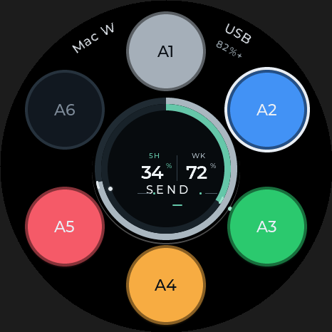
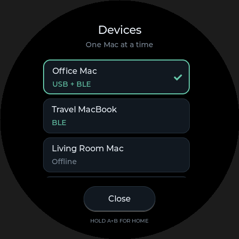

# Codex：选择 Mac 与 USB 优先

本次开发位于 `codex/single-host-usb-priority`，基于已推送的闪念胶囊提交
`1e67fbd`，固件版本 `V0.5-friday-codex.6`。2026-09-05 已写入核实后的 `ota_1`，
独立读回与受保护区域校验通过；设备仍待退出下载模式确认实体启动。

## 使用规则

- 一次只有一台 Mac 接收 Codex 按键、摇杆操作，其任务状态与额度显示相互绑定。
- 顶部显示设备名称和 `USB` / `BLE` / `Offline`，点击可打开设备列表。
- USB 完成 Mac 身份确认与原生 Codex RPC 通信后自动优先；接充电器、仅供电、
  或只启动身份助手不能抢占控制权。
- 拔线后只回到同一台 Mac 的蓝牙通道；它不可用时保持离线。其他 Mac 不自动接管。
- 可以手动选择另一台 Mac。USB 插着时不会周期性抢回；USB 休眠/唤醒也保留手动选择。
  一次新的 USB 插拔会重新应用 USB 优先。
- 切换前向旧会话释放已按住的操作，丢弃旧队列和触摸动作；切换后需要松手再按。
- 最多记住八个设备及首选设备，重启保留。蓝牙可保留备用连接用于发现/切换，
  它们不会同时获得 Codex 控制权。Friday 的 BLE 服务和录音/旅行功能保持独立。

## 每台 Mac 的小助手

构建与使用见 [Codex Host Identity](../companion/macos/host_identity/README.md)。
在每台 Mac 上运行这个助手，设备才能识别 USB 与蓝牙对应的是同一台 Mac，并显示名称。
助手只发送身份和额度；按键及任务状态继续由桌面端原生 Codex Micro 功能处理。

旧的 BLE 固件使用方式仍能以 `Mac XXXX` 临时别名工作。USB 控制的就绪条件要求
本次助手提供稳定身份，不能仅凭 USB 枚举猜测主机是谁。UUID 按 Mac 用户本地保存，
不要将身份文件复制到另一台电脑。

新固件将身份特征放进最后追加的第六个 BLE 服务（`...5C04`），原来五个服务的
40 个属性顺序和数量不变，保留已配对 Mac 缓存的 Friday 句柄。助手分别发现身份与
原额度服务，必要时按新服务 UUID 重试发现；本次升级不清除现有配对或设备 NVS。

## 构建与验证

USB 构建需要专用配置，见 [USB 传输和恢复说明](codex-usb-transport.md)。
普通 `sdkconfig.defaults` 中 USB 仍默认关闭，避免开发固件默默改变原来的烧录接口。

- `./tests/run_host_tests.sh`：主机选择、离线别名迁移、BLE 会话复用、USB 描述符、
  USB 关闭路径、现有 Friday 协议/录音编码及固件集成契约。
- `make -C companion/macos/host_identity test`：身份及额度数据、文件权限、模拟 app-server。
- `tests/run_lvgl_host_picker_qa.sh`：真实 LVGL 的圆屏截图和菜单输入隔离。
- ESP-IDF 5.5.4 / ESP32-S3 完整 USB 固件构建，输出在忽略目录 `build-usb/`。

2026-09-05 本地验证：以上 13 组主机/协议检查、18 项助手离线检查、LVGL 实际
指针交互检查均通过；USB 固件完整构建成功。助手 ZIP 已在独立临时目录解压并通过
严格签名验证。本机助手已单独安装并启动，未替换 Friday Companion，未改登录项。
下面的双 Mac 功能验收仍待执行。

固件：`build-usb/StopWatch-UserDemo.bin`，4,366,016 字节，SHA-256：
`8bbc1cfd69d7bf04109f4c0e21ccda02442d63ad8ff04c5affc51264bdee6d20`。
助手安装包：`companion/macos/host_identity/build/CodexHostIdentity.zip`。

刷前保护检查另补充了 USB 每轮总等待预算、发送失败断开及同主机恢复首选逻辑，
避免 USB 拥堵阻塞 Friday 的录音发送或软件重连抢回手动选择。兼容检查确认旧五个
蓝牙服务的 40 个属性与顺序保留，身份服务只追加在最后，不删除配对或 NVS。
Friday、音频 HAL、Launcher、时钟及秒表等源码与 `.5` 保持一致。

## 当前设备刷写记录

- 保留完整设备备份及原 `.5` / 独立 Friday 镜像；实体绿灯下载入口已确认。
- 先将启动选择设为已校验的 Friday 回退槽，再只写 `ota_1 @ 0x510000`。
- 新镜像 4,366,016 字节已独立读回逐字节比较一致；SHA-256 与上文一致。
- 刷后、启动前核验 11,591,680 字节受保护区全部通过，包括完整 Friday `ota_0`、
  bootloader、分区表、最新 NVS、PHY、storage、coredump 及其余非目标区。
- 最终 OTA 选择记录为 13 / 14，已选择新 `ota_1`。
- 当前仍停在 ROM 下载模式；已请求短按电源键启动。尚不能将写入/读回成功当作
  USB 或双 Mac 功能验收通过。

本机 SDK 的 `otatool` 与 `ParttoolTarget` 位置参数不兼容，第一次切槽触发了默认重启；
随后复核确认最新 NVS、程序和分区信息未变，只有预期 OTA 元数据改变。后续激活使用
备份目录的 `otatool_no_reset_adapter.py` 按关键字适配，并验证所有调用只访问 OTA
元数据且保留 no-reset 参数。回退时必须使用该适配器；SDK 文件未修改。

## 真机验收（尚未执行）

1. 两台 Mac 分别运行桌面端与身份助手：选择 A，只能 A 响应；B 的任务状态不得盖掉 A。
2. 按住 A/PTT 时切换主机，确认旧 Mac 得到释放，新 Mac 不收到残留操作；A+B 返回 launcher。
3. USB 接 B：显示 B / USB；关闭蓝牙后按键、任务状态及额度仍正常。
4. USB 接充电器：原蓝牙主机不变。拔掉有效 USB：回到 B/BLE，或 B 离线。
5. 手动切回 A，保持 USB 在 B，确认 B 的心跳、休眠及唤醒不抢回；重新插线才优先 B。
6. 重启固件、重启助手、反复插拔并刷新额度，确认首选记忆和状态归属正确。
7. 回归 Friday 录音流式传输、保存确认及跨屏行为。

USB OTG 模式会占用原 USB Serial/JTAG 的内部 PHY，因此烧录前必须确认准确设备、
硬件下载模式和回退备份。只写核实后的目标 OTA App 分区；不要使用通用整片 flash 命令。
